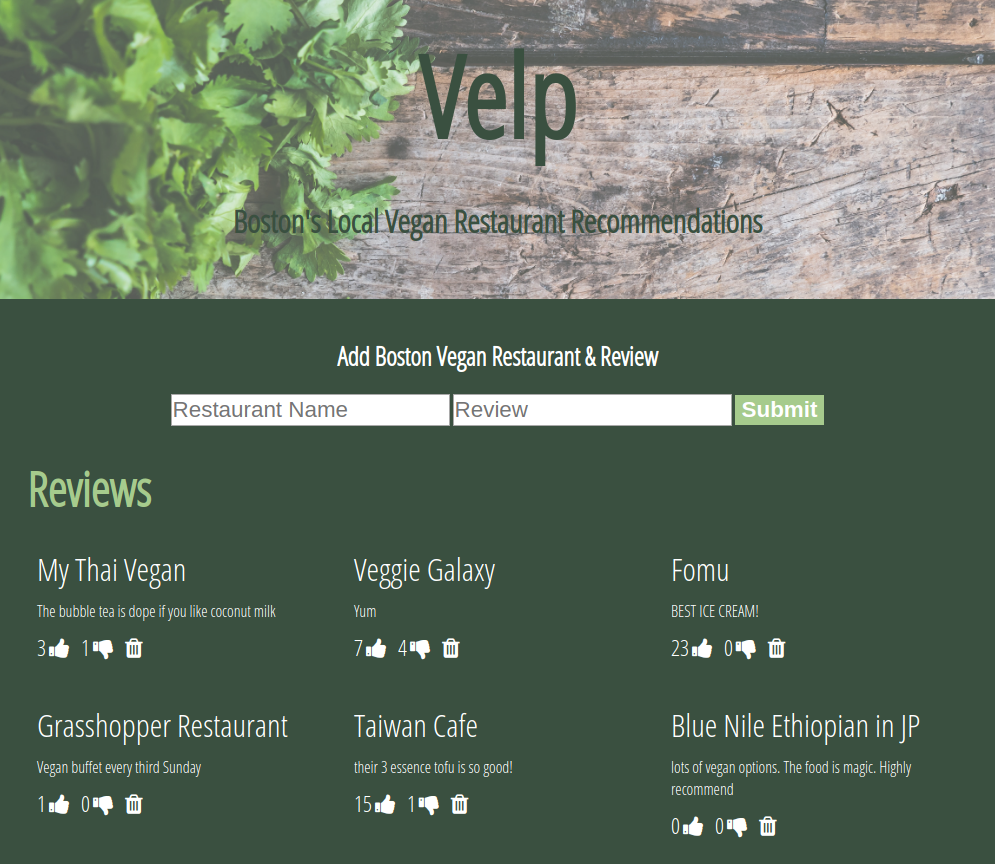

# Velp-Vegan-Restaurant-Review-App
A Fullstack Vegan Restaurant Review Sharing App. User's enter Vegan restaurant recommendations and reviews. 

## How It's Made:

**Tech used:** HTML5, CSS3, JavaScript, Node.js, Mongodb, Express, EJS.

## Lessons Learned:
Used Express framework for Node.js to make get, post, put, delete http requests. Learned how to connect a Mongodb database to my application and display the data back to user with EJS (Embedded Javascript templating) that generated my HTML.

## Examples:

Tech Wu-tang Name Generator https://github.com/ericamendez/wu-tang-generator-bootcamp2018c-week08

Card Memory Game https://github.com/ericamendez/matching-card-bootcamp2018c-week08/tree/answer

Complex NASA API https://github.com/ericamendez/complex-nasa-bootcamp2018c-week07
